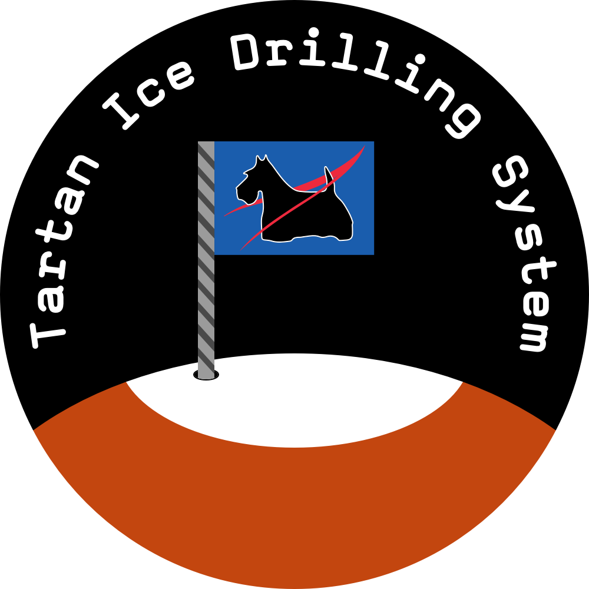

# tids-control

Software for autonomous Martian ice extraction, developed for the NASA Mars Ice Challenge.

## Tartan Ice Drilling System

The Tartan Ice Drilling System (TIDS), developed by students at Carnegie Mellon University for [NASA's Mars Ice Challenge](http://specialedition.rascal.nianet.org/), was a bold and innovative design for a Martian water extraction system and for the future of spaceflight. The overall design iteration was driven by advancements in key subsystems. The adaptation of ice core drilling processes for the Martian environment allowed for the application of effective and reliable Earth-based solutions. The implementation of an induction distillation process presented an opportunity to generate highly-pure water samples at low time and energy cost. The design of the control system was intended to mimic production spacecraft operations from the start, leading to more practical outcomes for future development. Altogether, TIDS combined many novel and innovative components into a single system, all of which yielded interesting takeaways for NASA research.

### Computing

As the brains of the drilling system, the control and communication system was designed to maximize autonomous operation and seamless function of all hardware components. Although it would be infeasible within the budget and timeframe to develop a system that worked without adaptation for a spacecraft, significant effort was put into designing a control and communication system that resembled true hardware and software for a NASA Mars mission. The best comparison for an active mission on the Martian surface was the [Curiosity rover system architecture](https://mars.jpl.nasa.gov/msl/mission/rover/brains) (the planned Mars 2020 rover is also based on Curiosity). Curiosity used two 200MHz BAE RAD750 computers with 256 kB of EEPROM, 256 MB of DRAM, and 2 GB of flash memory. The software was embedded C code running on top of Wind River Systems' VxWorks real-time operating system (RTOS). Our computing selection mimicked this design using a BeagleBone Black Wireless development board with a 1GHz ARM Cortex-A8 processor, 512 MB of DRAM, and 4 GB of flash memory. Our software was embedded C++ code running on top of an IoT distribution of the Debian 9.3 Linux kernel with RTOS support. Thus, our computing hardware and software was built as a proof-of-concept for a true Mars mission.

### Hardware

The control system was divided into five subgroups: power, positioning, drilling, heating, and chilling. In the power subgroup, a relay controlled power to all other components and a hall effect current sensor provided power consumption logging for the entire system. In the positioning subgroup, motors controlled movement on the X and Z axis, aided by inductive proximity sensors at the ends of each axis for homing. In the drilling subgroup, a 400W DC motor ran the drill, and an encoder, current sensor, and weight on bit sensor allowed for dynamic speed adjustment to remain below stall torque. In the heating subgroup, an induction controller ran the heating process, monitored by an infrared temperature sensor, and the melting chamber cover was sealed by servo motors. In the chilling subgroup, an air blower was controlled through the relay. The full set of components in the control system is detailed in the table below:

| Function | Component and Datasheet | Power | Control |
| --- | --- | ---: | --- |
| Main current sensor | [Phidgets i-Snail-VC-10](https://www.phidgets.com/productfiles/3500/3500_0/Documentation/3500_0_i-Snail-VC_Wiring_Diagram.pdf) | 120V AC | ADC |
| Power control relay | [8 Channel Relay](http://wiki.sunfounder.cc/index.php?title=8_Channel_5V_Relay_Module) | 5V DC | GPIO (8) |
| Axis proximity sensors (3) | [LJ12A3-4-Z/BY](https://www.reprap.me/lj12a3-4-z-by-inductive-proximity-sensor.html) | 12V DC | GPIO |
| X-Axis stepper motor | [Oriental PKP569FMN24A](https://catalog.orientalmotor.com/item/pkp-series-5-phase-stepper-motors/pk-series-60mm-5-phase-stepper-motors/pkp569fmn24a) + [CVD524-K driver](http://www.orientalmotor.com/products/pdfs/opmanuals/HM-60128-7E.pdf) | 24V DC | GPIO (6) |
| Z-Axis motor | [MMP TM36-268F-24V GP32-169]( http://www.midwestmotion.com/gearmotors.htm) + [L298N driver](https://www.sparkfun.com/datasheets/Robotics/L298_H_Bridge.pdf) | 24V DC | PWM + GPIO |
| Drill motor | [MMP D33-655J-90V GP81-035](http://www.midwestmotion.com/products/brushed/90VOLT/50-99%20RPM/250-449%20IN-LBS/MMP%20D33-655J-90V%20GP81-035.pdf) | 90V DC | PWM |
| Drill encoder | [MMP EU series optical encoder](http://www.midwestmotion.com/encoders/eu.pdf) | 5V DC | GPIO (3) |
| Drill current sensor | [LEM LTS 6-NP](https://www.lem.com/sites/default/files/products_datasheets/lts_6-np.pdf) | 5V DC | ADC |
| Drill weight on bit sensor | [CZL204E 50kg load cell](https://www.robotshop.com/media/files/pdf/datasheet-3136.pdf) + [HX711 amplifier](http://cdn.sparkfun.com/datasheets/Sensors/ForceFlex/hx711_english.pdf) | 5V DC | GPIO (2) |
| Heater induction controller | [1000W ZVS Induction Heating Board](https://www.amazon.com/Voltage-Induction-Heating-12V-36V-Flyback/dp/B075SG8NPT)| 36V DC | GPIO |
| Heater temperature sensor | [Melexis MLX90614](https://cdn-shop.adafruit.com/datasheets/MLX90614.pdf) | 5V DC | I2C |
| Heater cover servo motors (2) | [DS3218](https://www.autobotic.com.my/ds3218-servo-control-angle-270-degree-25t-servo-arm) | 5V DC | PWM |
| Chilling system | [Zoom 450W Air Blower](https://www.amazon.com/450-Watt-Efficient-Zoom-Commercial-Inflatables/dp/B00LOCE356) | 120V AC | GPIO |

### Electrical

As the different components had varying power requirements, we constructed a robust electrical system that took a single 120V AC input and outputted 120V AC, 90V DC, 36V DC, 24V DC, and 5V DC. This was achieved with a switching power supply, three buck converters, and one boost converter. The dynamic component of the electrical system was an eight channel relay, which allowed the computer to selectively supply power to each component, thereby reducing the overall power consumption at any time. Additionally, current sensors monitored the power draw for the entire system and the drill motor. The electrical  system was encapsulated within a strong plastic container to centralize the voltage converters, cooling fans, and to isolate potentially-hazardous internal wiring.

### Software

All software was custom designed for the BeagleBone with drivers for the various hardware components. The software was divided into two repositories: BBBKit and tids-control. [BBBKit](https://github.com/dgund/BBBKit) is a custom library developed by controls lead Devin Gund to abstract the I/O functions of the BeagleBone. Due to the rapid growth and continued development of the BeagleBone kernel, no existing library supported all I/O operations on the newest kernel. The development of BBBKit even led to some novel research into the relatively-undocumented kernel for [PWM configuration](https://stackoverflow.com/questions/50203064/pwm-on-beaglebone-black-v4-14) and the [PWM chip mappings](https://stackoverflow.com/questions/50204329/pwm-chip-to-pin-mapping-on-beaglebone-black-v4-14). The [tids-control](https://github.com/TartanIceDrillingSystem/tids-control) software, built on top of BBBKit, controlled the autonomous operation and communication with hardware component drivers. Commands and telemetry were transmitted wirelessly, just like a traditional spacecraft. Additionally, backup [tids-control-arduino](https://github.com/TartanIceDrillingSystem/tids-control-arduino) software was developed for testing and fly-by-wire control. Thus, our controls hardware and software were built as a proof-of-concept for a true Mars mission.

## Usage

This project is available open-source as a guide for future development of spacecraft and Martian technologies. As the software was developed to control the TIDS hardware components, running it standalone would not be very useful. Pin configurations and hardware-specific drivers will change based on the construction and hardware components used.

### Configure BeagleBone pins

    config-pin P9.14 pwm
    config-pin P9.16 pwm
    config-pin P9.19 i2c
    config-pin P9.20 i2c

### Modify BeagleBone /boot/uEnv.txt

    disable_uboot_overlay_video=1
    disable_uboot_overlay_audio=1

### Compile and Run

The project may be compiled using the included [Makefile](Makefile) and run (as root) from the executable at `./bin/CAPCOM`.

## Project Details

The project was developed by students at Carnegie Mellon University for NASA's 2018 [RASC-AL Mars Ice Challenge](http://specialedition.rascal.nianet.org). The controls group was composed of three dedicated members:

- [Devin Gund](https://github.com/dgund), controls lead, (Electrical & Computer Engineering '18)
- [Christina Ou](https://github.com/christinaou) (Electrical & Computer Engineering '19)
- Ismael Mercier (Electrical & Computer Engineering '20)

For more information about the project, see Devin's description of his [NASA Mars Ice Challenge experience](https://dgund.com/experiences/nasa-challenge).
